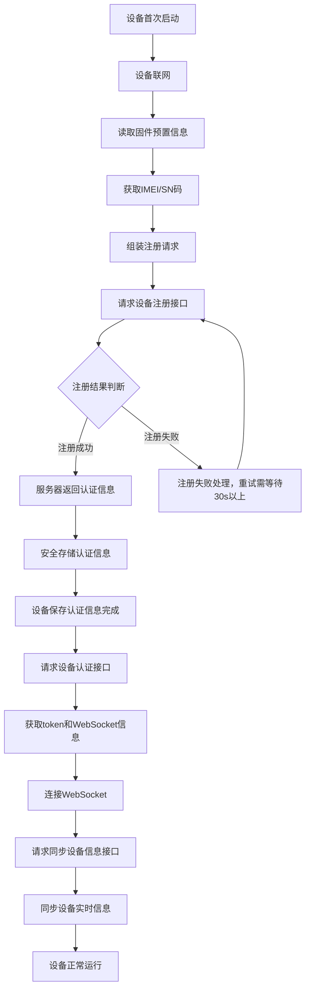

# AIOS设备注册认证流程

本文档详细描述了AIOS设备的注册、认证和同步流程，包括设备首次注册、认证获取token、WebSocket连接以及实时信息同步等关键环节。

**连接地址说明：**

| **参数名** | **必填** | **可选值**                         | **说明**         |
| ---------------- | -------------- | ----------------------- | ------------- |
| URL(公网内网测试环境）   | ✅             | http://192.168.0.188:20000/v2 |  http api的地址           |
| URL(线上测试环境)    | ✅             | https://apiaios.nextbigseek.com/v2  |http api的地址 |


## 流程概述

### 设备注册认证完整流程



## 设备注册阶段

### 设备注册接口

- **接口路径**: `POST /device/register`
- **接口描述**: 设备出厂注册

#### 请求参数 (DeviceRegisterReq)

```json
{
  "device_user_id": "uint64 | 设备用户ID（可选）",
  "device_product_id": "uint64 | 关联设备产品ID（可选）",
  "tenant_user_id": "uint64 | 关联租户用户ID（可选）",
  "imei": "string | 设备IMEI（可选）",
  "sn": "string | 设备序列号（可选）"
}
```

#### 响应参数 (DeviceRegisterResp)

```json
{
  "device": {
    "id": "uint64 | 主键ID",
    "user_id": "uint64 | 设备用户ID",
    "access_key": "string | 设备访问密钥ID",
    "access_secret": "string | 设备访问密钥",
    "device_product_id": "uint64 | 关联设备产品ID",
    "tenant_user_id": "uint64 | 关联租户用户ID",
    "imei": "string | 设备IMEI",
    "sn": "string | 设备序列号"
  }
}
```

### 设备注册信息要求

设备注册需要提供以下信息：

#### 固件预置信息（必须）

- **设备产品ID**：写入设备固件中的关联设备产品ID
- **租户用户ID**：写入设备固件中的关联租户用户ID

#### 设备可获取信息（可选）

- **IMEI码**：国际移动设备识别码（如能获取则提供）
- **SN码**：设备序列号（如能获取则提供）

### 注册流程

#### 设备首次启动注册流程

1. **设备联网**：设备首次启动后建立网络连接
2. **读取固件信息**：从固件中读取预置的设备产品ID和租户用户ID
3. **获取设备标识**：尝试获取IMEI码和SN码（如能获取则提供）
4. **组装注册请求**：使用固件预置信息和设备标识信息组装注册请求
5. **请求注册接口**：调用设备注册接口进行注册
6. **处理注册结果**：
   - 注册成功：接收服务器返回的认证信息
   - 注册失败：根据错误码进行重试或错误处理，重试需等待30s以上

### 认证信息存储要求

注册成功后，设备必须安全存储以下认证信息：

#### 必须存储的信息

- **设备用户ID**：服务器返回的设备用户唯一标识
- **访问密钥ID**：`access_key`，用于设备身份认证
- **访问密钥**：`access_secret`，用于请求签名验证

#### 存储要求

- **存储位置**：必须存储在设备的受保护内存区域
- **安全性**：存储区域应具备防篡改和防删除特性
- **持久性**：设备重启后认证信息必须保持有效
- **唯一性**：每个设备只能存储一套认证信息

#### 使用规则

- 后续所有API请求必须使用存储的认证信息
- 认证信息一旦存储，不得修改或删除
- 设备生命周期内应保持认证信息的稳定性

## 设备认证接口

### 接口信息

- **接口路径**: `POST /device/auth`
- **中间件**: `EncryptionMiddleware, NoAuthMiddleware`
- **接口描述**: 设备认证，设备每次上线后调用

### 请求参数 (DeviceAuthReq)

```json
{
  "access_key": "string | 设备认证密钥（必传）",
  "access_secret": "string | 设备密码（必传）",
  "imei": "string | 设备IMEI（可选）",
  "sn": "string | 设备序列号（可选）",
  "region": "string | 国家码（可选，如不传则通过IP判断）",
  "language": "string | 语言（可选，不传则按系统设置默认）"
}
```

### 响应参数 (DeviceAuthResp)

```json
{
  "user": {
    "id": "uint64 | 用户ID也是ws协议中的X-Device-Id",
    "uid": "string | 用户唯一标识",
    "region": "string | 国家/地区码",
    "language": "string | 语言",
    "currency": "string | 货币类型",
    "status_inactivate": "bool | 是否未激活",
    "status_ban": "bool | 是否被封禁",
    "token": "string | 认证令牌（JWT）"
  },
  "profile_device": {
    "id": "uint64 | 设备资料ID",
    "user_id": "uint64 | 设备用户ID",
    "device_key": "string | 设备认证密钥",
    "owner_user_id": "uint64 | 所属用户ID",
    "name": "string | 设备名称",
    "device_product_id": "uint64 | 关联设备产品ID",
    "imei": "string | 设备IMEI",
    "sn": "string | 设备序列号",
    "config_agentic_id": "string | 配置的智能体ID"
  },
  "ws": {
    "url": "string | WebSocket连接地址"
  }
}
```

### 接口说明

1. **认证方式**：使用`access_key`和`access_secret`进行设备认证
2. **返回信息**：
   - 用户信息（已清理鉴权敏感信息）
   - 设备资料信息
   - WebSocket连接信息（包括地址和智能体配置）
3. **Token作用**：后续接口调用需要携带此token进行身份验证

## WebSocket连接

### 连接流程

1. 设备通过认证接口获取WebSocket地址
2. 使用获取的URL建立WebSocket连接
3. 连接成功后，设备进入实时通信状态

### WebSocket通信协议

- **心跳机制**：定期发送心跳包保持连接
- **消息格式**：JSON格式的消息体
- **重连机制**：连接断开后自动重连

## 同步设备实时信息接口

### 接口信息

- **接口路径**: `POST /device/sync`
- **中间件**: `EncryptionMiddleware, UserAuthMiddleware`
- **接口描述**: 同步实时信息，此接口用于终端WebSocket连接成功后主动查询一次保证最新

### 请求参数 (DeviceSyncReq)

```json
{
  // 请求体为空，通过认证头携带token,需要设备端提供能够获取哪些信息
}
```

### 响应参数 (DeviceSyncResp)

```json
{
  "user": {
    "id": "uint64 | 用户ID",
    "uid": "string | 用户唯一标识",
    "region": "string | 国家/地区码",
    "language": "string | 语言",
    "currency": "string | 货币类型",
    "status_inactivate": "bool | 是否未激活",
    "status_ban": "bool | 是否被封禁"
  },
  "profile_device": {
    "id": "uint64 | 设备资料ID",
    "user_id": "uint64 | 设备用户ID",
    "device_key": "string | 设备认证密钥",
    "owner_user_id": "uint64 | 所属用户ID",
    "name": "string | 设备名称",
    "device_product_id": "uint64 | 关联设备产品ID",
    "imei": "string | 设备IMEI",
    "sn": "string | 设备序列号"
  },
  "wallet": {
    "id": "uint64 | 钱包ID",
    "user_id": "uint64 | 关联用户ID",
    "balance_free": "string | 免费余额",
    "balance_bonus": "string | 赠送余额",
    "balance_recharge": "string | 充值余额",
    "currency": "string | 货币类型"
  }
}
```

### 设备实时信息同步内容

设备需要同步的实时信息包括但不限于：

#### 基础设备信息

- **设备电量**：当前电池电量百分比
- **网络状态**：WiFi/4G/5G等连接状态
- **设备温度**：当前设备温度
- **存储空间**：剩余存储空间
- **内存使用**：当前内存使用情况

#### 运行状态信息

- **运行时长**：设备连续运行时间
- **服务状态**：各项服务的运行状态
- **错误日志**：最近的错误信息
- **性能指标**：CPU使用率、网络流量等

#### 环境信息

- **地理位置**：GPS坐标信息
- **环境温度**：周围环境温度
- **连接设备**：已连接的周边设备

### 接口调用时机

1. **WebSocket连接成功后**立即调用
2. **设备状态发生变化时**主动调用
3. **定时同步**（如每30分钟）

## 错误处理

### 常见错误码

- `401 Unauthorized`：认证失败，access_key/secret无效
- `403 Forbidden`：设备被封禁或权限不足
- `404 Not Found`：设备不存在
- `500 Internal Server Error`：服务器内部错误

### 重试机制

- 认证失败：重新获取access_key/secret
- 网络异常：指数退避重试
- 服务不可用：等待服务恢复后重试

## 安全考虑

### 数据传输安全

- 所有接口调用使用[AIOS服务通讯加密流程](../AIOS服务通讯加密流程.md)中描述的加密方案
- WebSocket通信使用WSS（WebSocket Secure）协议

### 认证安全

- access_key/secret需要安全存储
- token具有有效期，需要定期刷新
- 支持token吊销机制

### 设备安全

- 设备标识信息需要防篡改
- 支持设备黑名单机制
- 异常行为检测和告警

## 部署配置

### 环境变量

```bash
# 设备认证相关配置
DEVICE_AUTH_TIMEOUT=3600  # token有效期（秒）
DEVICE_MAX_CONNECTIONS=1000  # 最大并发连接数

# WebSocket配置
WS_HEARTBEAT_INTERVAL=30  # 心跳间隔（秒）
WS_MAX_MESSAGE_SIZE=1048576  # 最大消息大小（字节）
```

### 数据库表结构

主要涉及的表：

- `device_profile`：设备资料表
- `user`：用户表
- `wallet`：钱包表
- `device_credit`：设备额度表

## 测试用例

### 设备注册测试

```javascript
// 模拟设备注册请求
const registerData = {
  imei: "123456789012345",
  sn: "SN20240001",
  region: "CN",
  language: "zh",
};

// 期望返回access_key和access_secret
```

### 设备认证测试

```javascript
// 模拟设备认证请求
const authData = {
  access_key: "device_key_123",
  access_secret: "secret_password",
  imei: "123456789012345",
};

// 期望返回token和WebSocket信息
```

### 信息同步测试

```javascript
// 模拟信息同步请求
const syncData = {
  // 设备实时信息
  battery_level: 85,
  network_status: "wifi",
  temperature: 35.5,
  storage_free: "2.5GB",
};

// 期望返回确认响应
```

## 附录

### 设备标识格式规范

1. **IMEI格式**：15位数字
2. **SN格式**：字母数字组合，最大长度32位，可以是Mac地址
a. **MAC地址格式**：去除分隔符，全部大写（如：AABBCCDDEEFF）

### 相关接口文档

- [设备资料查询接口](./device.api#L35-35)
- [设备钱包查询接口](./device.api#L40-40)
- [设备钱包流水查询接口](./device.api#L45-45)

### 更新日志

- **v1.0**：初始版本，定义基础设备注册认证流程
- **v1.1**：添加设备实时信息同步接口说明
- **v1.2**：完善安全考虑和错误处理机制

此文档为AIOS设备注册认证流程的技术参考，开发人员可根据此文档实现设备端的注册认证功能。
