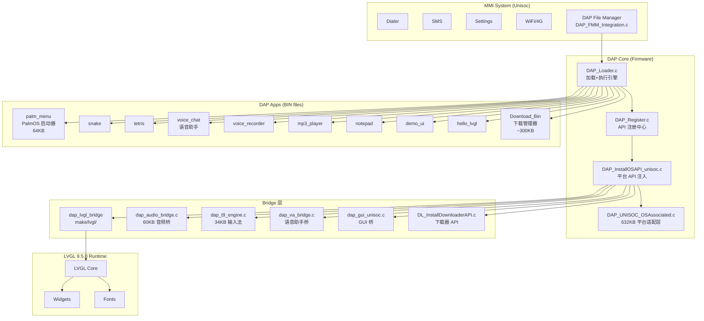

# TM02 Architecture — James Legacy System

**Author:** KaiwenZheng | **Project:** demo_merge | **Date:** 2026-03-26

---

## 1. Git Ancestry

| 项目 | 值 |
|------|------|
| James Remote | `http://192.168.0.92/feature-phone/UMS9117_BSP.git` |
| James Commit | `f1592ec0` ("The last commit") |
| James Branch | `main` |
| James `.git` | **不存在** — 仅有 `agit/` (bare repo 格式) |
| 共同祖先 | 两个仓库为独立 remote，同一 BSP 基线分叉。无法通过 `git merge-base` 直接比较 |

**结论：** James 的 UMS9117_BSP 和我们的 kz_fp_tm28r 源自同一个 Unisoc BSP，但走了不同的演化路线。James 专注 demo 功能（LVGL app + 下载分发），我们专注安全加固（BIN2/BIN3 + 签名 + 绑定）。

---

## 2. System Architecture



---

## 3. Key Architecture Insight

> **James 并没有替换 MMI，而是在 DAP 之上叠加了 LVGL App Runtime + 一套完整的应用分发系统。**

核心分层：
1. **MMI** — 系统入口（不变）→ 通过 FMM 触发 DAP
2. **DAP Core** — 加载引擎 + API 注册 (`DAP_Loader.c` + `DAP_Register.c`)
3. **Bridge 层** — LVGL / Audio / T9 / VA / GUI / Downloader — 将平台能力注入 APP
4. **LVGL 9.5.0** — App UI 运行时
5. **Apps** — 12 个 BIN 应用，全部运行于 LVGL 之上

---

## 4. Call Chain

### 4.1 主链路：用户打开 DAP App
```
用户操作 → MMI File Manager → DAP_FMM_IsBinFile() → DAP_ExecuteAP()
  → DAP_Loader.c: 加载 BIN/BIN2
  → DAP_Register.c: 注入 OS API + LVGL API + Audio API + ...
  → APP Entry.c → Main.c → LVGL UI
```

### 4.2 App 下载链路
```
palm_menu (PalmOS 启动器) → 用户选择"下载" → Download_Bin App
  → DAP_Downloader.c: HTTP 下载 BIN 文件
  → 写入 D:\DAP\ → 返回 palm_menu → 运行已下载 App
```

### 4.3 语音助手链路
```
palm_menu → voice_chat App
  → dap_va_bridge.c: 语音识别桥
  → dap_audio_bridge.c: 录音/播放
  → HTTP → 云端 AI → 返回结果 → LVGL 显示
```

---

## 5. Top-Level Directory Comparison

| 目录 | James | 主线 | 差异说明 |
|------|-------|------|----------|
| `Third-party/DAP/` | ✅ 12 apps + 扩展 SDK | ✅ 2 apps (hello_bigseek + _legacy) | **核心差异区** |
| `Third-party/lvgl-9.5.0/` | ✅ 完整 LVGL 源码 | ❌ 不存在 | **需 merge** |
| `make/lvgl/` | ✅ lvgl.mk | ❌ 不存在 | **需 merge** |
| `DAPS/` | ftp, iperf, nv_param | 同 | BSP 工具，噪声 |
| `DOCS-main/` | ✅ AI 方案/协议/文档 | ❌ 不存在 | 参考用，不 merge |
| `NBS Technical Memo/` | ✅ James 的 memo | ❌ 不存在 | 参考用，不 merge |
| `agit/` | ✅ bare git repo | ❌ (用 .git) | James 专有 |
| `MS_MMI_Main/` | 可能有修改 | 我们的版本 | **需重点检查** |
| `AIOS/` | ❌ 不存在 | ✅ 我们的工作流 | 我们专有 |
| `AIOShooks/` | ❌ | ✅ | 我们专有 |
| 其余 BSP 目录 | 同基线 | 同基线 | BSP 噪声，忽略 |
