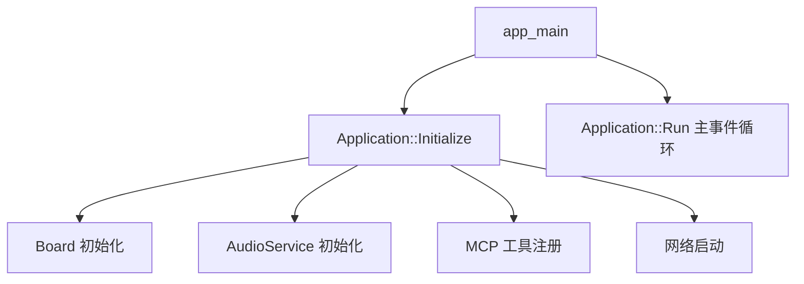
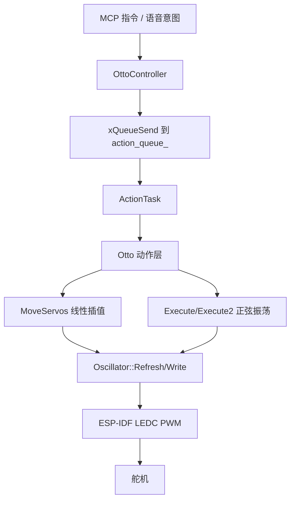

# 小智 ESP32 项目嵌入式架构说明

## 1. 文档目的

这份文档用于回答 3 个问题：

1. 这个项目的嵌入式侧使用什么操作系统
2. 这个项目运行在什么芯片/指令架构上
3. `otto-robot` 这类机器人板子的舵机控制采用什么软件架构

本文基于当前仓库代码整理，重点会区分：

- 项目整体架构
- `otto-robot` 这个具体板型的实现

---

## 2. 嵌入式操作系统

### 2.1 结论

这个项目使用的是 **ESP-IDF + FreeRTOS**。

### 2.2 依据

- 程序入口是 `app_main()`，这是 ESP-IDF 应用的标准入口，见 `main/main.cc`
- 代码大量直接使用 FreeRTOS API，例如：
  - `xTaskCreate`
  - `xQueueCreate`
  - `xEventGroupWaitBits`
  - `vTaskDelay`
- `main/system_info.h`、`main/application.h`、`main/protocols/websocket_protocol.h` 等都直接包含了 FreeRTOS 头文件
- `main/audio/README.md` 也明确写到音频服务运行在多个 dedicated FreeRTOS tasks 上

### 2.3 可以怎样理解

从工程风格上看，这不是 Linux 类系统，也不是裸机轮询程序，而是：

- 底层 SDK: **ESP-IDF**
- 实时操作系统: **FreeRTOS**
- 应用组织方式: **任务 + 队列 + 事件组 + 回调**

---

## 3. 芯片与指令架构

## 3.1 项目整体

这个仓库不是只支持一种芯片，而是支持多个 Espressif SoC。

从 `main/idf_component.yml` 和各板型 `config.json` 可以看出，项目至少覆盖了这些 target：

- `esp32`
- `esp32s3`
- `esp32p4`
- 以及部分板型下的 `esp32c3`、`esp32c5`、`esp32c6`、`esp32h2`

所以从“项目整体”角度看，它是一个 **多 target 的 ESP-IDF 工程**。

### 3.2 你这套机器人对应的 target

`otto-robot` 的板型配置在 `main/boards/otto-robot/config.json`，其中明确指定：

```json
"target": "esp32s3"
```

所以你这套机器人对应的是：

- 芯片目标: **ESP32-S3**
- 指令架构: **Xtensa**

更具体一点，ESP32-S3 属于 **Xtensa LX7 架构**。这一点是根据 ESP32-S3 芯片家族特性做的硬件常识判断，不是仓库里直接写死的字符串。

### 3.3 如何在代码里看到 target

项目通过 `CONFIG_IDF_TARGET` / `CONFIG_IDF_TARGET_ESP32S3` 这类宏区分目标平台，例如：

- `main/system_info.cc`
- `main/CMakeLists.txt`
- `main/audio/audio_service.cc`

这说明工程编译时会根据 target 切不同实现，而不是一套二进制通吃。

---

## 4. 项目整体软件架构

## 4.1 顶层结构

从 `main/main.cc` 和 `main/application.cc` 看，这个项目的整体结构可以概括为：



### 4.2 核心分层

可以把整个工程理解成 5 层：

1. **硬件板级层**
   - 各种 `Board` 实现
   - 负责屏幕、按键、音频、网络、摄像头、舵机等硬件适配

2. **系统服务层**
   - `Application`
   - `AudioService`
   - `Protocol`（WebSocket / MQTT）
   - `McpServer`

3. **设备能力层**
   - 显示
   - 音频采集/播放
   - 摄像头
   - 机器人动作

4. **协议与工具层**
   - WebSocket / MQTT 通信
   - MCP 工具注册与调用

5. **交互层**
   - 语音
   - 屏幕 UI
   - 机器人动作响应

### 4.3 并发模型

项目整体是典型的 FreeRTOS 并发架构：

- `Application::Run()` 负责主事件循环
- 音频部分拆成多个任务并行处理
- 某些板级能力会单独起任务
- 通过队列、任务、事件组协调数据流和状态流

---

## 5. `otto-robot` 的控制架构

## 5.1 结论

`otto-robot` 的舵机控制不是单独的“第二套处理器架构”，而是运行在 **ESP32-S3 + FreeRTOS** 上的一套 **分层软件控制架构**。

它的核心控制链路是：

```text
MCP/上层命令
  -> OttoController
  -> 动作队列
  -> ActionTask
  -> Otto 动作封装层
  -> Oscillator 振荡/PWM层
  -> LEDC 50Hz PWM
  -> 舵机
```

也就是说，舵机控制的“架构”更准确地说是 **软件控制架构**，不是另一种 CPU 架构。

---

## 6. `otto-robot` 舵机控制的分层说明

### 6.1 板级硬件配置层

在 `main/boards/otto-robot/config.h` 中，定义了机器人硬件配置：

- 左腿舵机
- 右腿舵机
- 左脚舵机
- 右脚舵机
- 左手舵机
- 右手舵机

代码里通过 `HardwareConfig` 把这些 GPIO 抽象出来，然后传给控制器初始化。

### 6.2 控制入口层: `OttoController`

`main/boards/otto-robot/otto_controller.cc` 里的 `OttoController` 是舵机控制的主控制器。

它主要负责：

- 初始化 `Otto` 运动对象
- 从 NVS 加载舵机 trim 微调参数
- 创建动作队列 `action_queue_`
- 注册 MCP 工具，例如：
  - `self.otto.action`
  - `self.otto.servo_sequences`
  - `self.otto.stop`
  - `self.otto.set_trim`
  - `self.otto.get_status`

这里的设计本质上是一个 **命令驱动控制器**。

### 6.3 调度层: 动作队列 + ActionTask

`OttoController` 并不是收到命令就立刻在调用线程里直接打舵机，而是：

1. 把动作请求封装成 `OttoActionParams`
2. 通过 `xQueueSend()` 放进 `action_queue_`
3. 由独立的 `ActionTask` 消费队列并执行动作

这层架构的优点是：

- 把“动作请求”和“动作执行”解耦
- 避免多个上层请求同时直接抢占舵机
- 更适合机器人这种连续动作设备

这是一个很典型的 **生产者-消费者模型**。

### 6.4 动作封装层: `Otto`

`main/boards/otto-robot/otto_movements.h/.cc` 中的 `Otto` 类，是运动学和动作编排层。

它封装了两类能力：

1. **基础控制能力**
   - `MoveServos`
   - `MoveSingle`
   - `AttachServos`
   - `DetachServos`
   - `SetTrims`
   - `Home`

2. **高级动作能力**
   - `Walk`
   - `Turn`
   - `Jump`
   - `Swing`
   - `Moonwalker`
   - `Bend`
   - `ShakeLeg`
   - `HandsUp`
   - `HandWave`
   - `Greeting`
   - `Showcase`

这一层可以理解成：

- 对上: 提供“动作语义”
- 对下: 转成每个舵机的目标角度、偏移、振幅、相位、周期

所以它是 **动作编排层 / 运动抽象层**。

### 6.5 波形与插值层: `Oscillator`

`main/boards/otto-robot/oscillator.h/.cc` 是真正把动作转换成 PWM 控制量的关键层。

它做了几件事：

- 维护舵机当前角度
- 支持 trim 偏移
- 支持反向
- 支持角速度限制 `diff_limit_`
- 支持正弦振荡
- 把角度转换成 PWM duty

其中最关键的是两种控制方式：

1. **线性插值移动**
   - `Otto::MoveServos()`
   - 每 10ms 更新一次位置
   - 适合从 A 角度平滑移动到 B 角度

2. **正弦振荡控制**
   - `Otto::OscillateServos()`
   - `Otto::Execute()`
   - `Otto::Execute2()`
   - 适合步态、摆动、挥手、抖动等周期性动作

这层本质上是一个 **轨迹生成层**。

### 6.6 硬件驱动层: LEDC PWM

`Oscillator::Attach()` 和 `Oscillator::Write()` 直接调用 ESP-IDF 的 `LEDC` 外设：

- PWM 频率设置为 `50Hz`
- 使用 `LEDC_LOW_SPEED_MODE`
- 使用 `LEDC_TIMER_13_BIT`

舵机角度最终会被换算成 PWM 占空比，然后通过 LEDC 输出到对应 GPIO。

所以在硬件驱动层上，舵机方案是：

- **ESP32-S3 的 LEDC PWM 外设**
- **50Hz 舵机控制信号**

这属于典型的 **软件角度控制 + PWM 输出驱动**。

---

## 7. `otto-robot` 舵机控制架构图



---

## 8. 这套舵机控制架构的特点

### 8.1 优点

- 分层清晰，上层动作和底层 PWM 分离
- 适合做 MCP 工具调用和语音驱动
- 动作队列机制可以避免并发冲突
- 振荡器模型很适合双足机器人步态
- 支持 trim、限速、相位、振幅、周期等参数化控制

### 8.2 限制

- 仍然是开环控制，没有编码器反馈
- 动作精度依赖舵机本身一致性和机械装配质量
- 多舵机同时动作时，稳定性依赖动作参数是否合理
- 极端大幅度动作需要软件侧额外限幅保护

---

## 9. 最终结论

### 9.1 项目整体

- 操作系统: **FreeRTOS**
- SDK: **ESP-IDF**
- 架构风格: **事件驱动 + 多任务并发 + 板级抽象**
- 支持多个 Espressif target

### 9.2 你这套 `otto-robot`

- 编译 target: **esp32s3**
- 芯片架构: **Xtensa**
- 舵机控制方式: **LEDC PWM**
- 舵机软件架构: **MCP/动作命令 -> 动作队列 -> Otto 运动层 -> Oscillator -> PWM 输出**

### 9.3 一句话概括

这个项目本质上是一个运行在 **ESP-IDF + FreeRTOS** 上的多任务嵌入式 AI 设备框架；而 `otto-robot` 的舵机控制，则是在 **ESP32-S3** 上通过 **命令队列 + 运动编排 + PWM 驱动** 实现的一套机器人动作控制架构。
